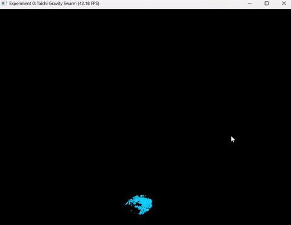

# CG-Lab 图形学工程规范与万有引力粒子仿真实验
## 一、实验背景与目的
### 实验概述
本实验基于现代化图形学工程开发流，采用 Rust 编写的 `uv` 包管理器实现项目级隔离虚拟环境，使用标准 `src` 代码目录布局解耦工程结构，结合 Taichi 高性能并行计算框架完成万有引力粒子群 GPU 仿真，完整打通「环境搭建-代码分层解耦-GPU并行物理计算-实时可视化」全链路。
### 实验目标
1. 搭建隔离、无依赖冲突的 Python 图形学开发环境，规范项目工程目录；
2. 掌握 Taichi JIT 编译与 GPU 硬件加速机制，实现大规模粒子万有引力并行仿真；
3. 建立标准化 Git 版本管理工作流，规范代码仓库提交与文档编写。
### 核心技能清单
- [x] TRAE VS Code 内核IDE代码开发、AI辅助排错
- [x] uv 项目级虚拟环境管理、依赖隔离
- [x] Taichi GPU并行计算与实时渲染
- [x] Git 分布式代码版本控制

## 二、核心工具简介
1. **TRAE IDE**
基于VS Code内核的图形学专用IDE，内置代码补全、语法校验、AI辅助调试功能，适配Python+Taichi开发。
2. **uv**
高性能Rust实现Python包管理器，为每个项目生成独立`.venv`虚拟环境，彻底隔离多实验依赖冲突。
3. **Taichi (太极)**
面向图形学的高性能并行计算库，自动JIT编译Python代码，支持CUDA/Metal/Vulkan/OpenGL/CPU多硬件后端，实现跨平台GPU加速仿真。
4. **Git**
分布式版本控制系统，完整记录代码修改历史，支持多分支开发、代码回滚与远程仓库同步。

## 三、实验要求
1. 环境隔离：使用uv创建项目专属虚拟环境，不污染全局Python；
2. 工程规范：遵循标准`src`分层布局，分离配置、物理计算、可视化入口代码，解决路径混乱问题；
3. GPU仿真：基于Taichi实现万有引力粒子群，利用GPU并行完成粒子受力、速度、位置迭代更新；
4. 版本交付：完整代码上传私有Git仓库，配套README说明文档+运行演示GIF，最终提交仓库链接。

## 四、项目目录结构（标准src布局）
├── .venv/ # uv 生成项目隔离虚拟环境（gitignore 忽略）
├── src/
│ └── Work0/
│ ├── config.py # 全局仿真参数、硬件后端配置
│ ├── physics.py # 万有引力受力、粒子更新核心计算逻辑
│ └── main.py # 程序入口、GUI 交互渲染窗口
├── pyproject.toml # uv 项目依赖配置文件
├── .gitignore # 忽略虚拟环境、缓存、运行临时文件
└── README.md # 项目说明文档

## 五、部署与运行步骤
# 1. 创建项目文件夹并进入
mkdir CG-Lab && cd CG-Lab
# 2. uv初始化项目，自动生成pyproject.toml与.venv
uv init
# 3. 安装Taichi依赖
uv add taichi numpy

##效果演示

